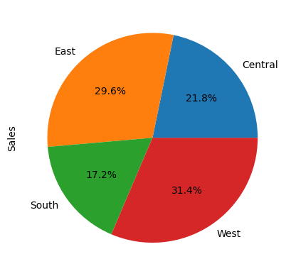
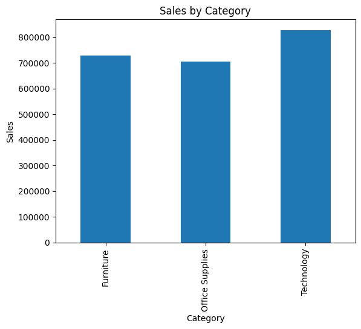
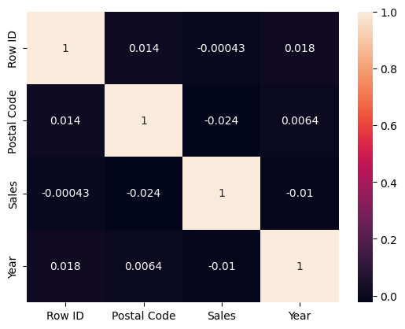

# 📊 E-commerce Sales Data Analysis

## 🚀 Overview
This project analyzes an E-commerce dataset (~10,000+ records) to uncover sales trends, regional performance, and category insights.

## 🛠️ Tools
Python | Pandas | NumPy | Matplotlib | SQL

## 📊 Analysis Performed
- Data Cleaning & Preprocessing
- Exploratory Data Analysis (EDA)
- Sales by Region
- Category-wise Analysis
- Correlation Analysis

## 📈 Key Insights
- West region has highest sales (~31.4%)
- Technology category leads revenue
- South region has lowest performance (~17.2%)

## 📷 Visualizations

### Sales by Region

### Sales by Category

### Correlation Heatmap

## 💡 Business Impact
- Helps identify high-performing regions
- Supports data-driven sales strategy
- Highlights growth opportunities

## 🔗 Future Scope
- Build dashboard (Power BI)
- Add predictive analysis
